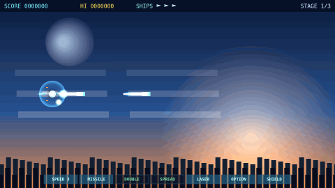

# ASTRAL VANGUARD — *Iron Requiem*

A high-quality, browser-based **horizontal scrolling shoot-'em-up** in the
Gradius tradition. Three stages (~2 minutes each) with a unique boss apiece,
a full power-capsule weapon system, layered particle effects, synthesized
chiptune audio, and "learn-to-win" first-run-killer gimmicks. Runs entirely in
the browser — **no build step, no installs, no assets required.**



---

## Play it now

**Easiest:** double-click **`index.html`**. That's it — it's fully
self-contained and runs offline.

**Local server** (recommended; needed if you later add generated PNG assets):

```bash
./start.command          # macOS: double-click it. Linux: bash start.command
# or:
npm run serve            # → http://localhost:8080
# or:
python3 -m http.server 8080
```

### Play on a phone / tablet (same Wi-Fi)
1. Run `./start.command` (or `npm run serve`) on your computer.
2. It prints a `http://<your-ip>:8080` LAN address — open that on the phone.
3. Hold the device **landscape**. Drag the left side to move; tap **FIRE** /
   **POWER** on the right.

---

## Controls

| | Keyboard / Mouse | Touch |
|---|---|---|
| Move | Arrows / WASD | Drag anywhere |
| Fire | Z / Space (or hold mouse) | **FIRE** button |
| Activate power-up | X / Shift | **POWER** button |
| Pause | Esc | — |
| Start / Continue | Enter / Fire | Tap |

## Power-up system (Gradius-style)

Collect red **capsules** (they drop often). Each one advances the highlighted
slot on the bottom meter. Press **POWER** to activate whatever is highlighted:

`SPEED` (×4) · `MISSILE` · `DOUBLE` · `SPREAD` (3-way) · `LASER` (piercing) ·
`OPTION` (trailing drones, ×3) · `SHIELD`

`DOUBLE / SPREAD / LASER` are your main-weapon mode (mutually exclusive); the
rest stack on top, so you can mix-and-match to keep things interesting.

## "First-run killer" gimmicks — fair by design

You'll die to these once; then a **warning** appears every time they recur, so
once you learn them you can always win. Lives + **infinite continues**.

- **Falling debris** dropping from above
- **Decoy capsules** that detonate if grabbed
- **Rear assaults** — enemies that swoop in from *behind* you
- **Crusher gates** (press machines) you must time

## Bosses

Each boss has armored panels that *deflect* your fire (sparks, no damage) and a
**glowing exposed core** that is the only vulnerable hitbox — so a hit on the
weak point **always** lands. HP bar + core hit-flash make damage obvious.
Attacks escalate through HP-based phases.

---

## Visuals & audio

By default all graphics are **procedurally drawn** (metallic gradients,
additive-blend glow, multi-layer explosions with flash + fireball + debris +
smoke + shockwave rings, engine-flame pulse, banking after-images, muzzle
flashes). Audio (BGM + SFX) is **synthesized live with the Web Audio API** —
no media files anywhere.

### Optional: real AI-generated mech-SF sprites
The art is built behind a swap layer. To use real generated images instead:

```bash
export OPENAI_API_KEY=sk-...
npm install            # playwright is used only for chroma-keying
npm run gen-assets
```

`tools/gen_assets.mjs` asks OpenAI's image model for each sprite rendered on a
**chroma-green** background (the v2 image model has no transparency), keys the
green out to transparent PNGs in `assets/`, writes `assets/manifest.json`, and
the game **auto-detects and uses them on reload** — zero code changes.
Backgrounds are generated as opaque, figure-free landscapes.

> Note: this was developed in a sandbox with no OpenAI access (the API and
> ChatGPT are network-blocked there), so the shipped build uses the procedural
> art path. Run the script above on your own machine to drop in real images.

---

## Quality assurance

`tests/smoke.mjs` drives the game in **headless Chromium (Playwright)** and
checks:

- Title + all 3 stages + all 3 bosses render (canvas captures in `shots/`)
- **Console / page errors == 0**
- **Boss hitbox auto-probe**: a synthetic shot on the CORE numerically reduces
  HP, a shot on ARMOR does **not**, and a live god-mode fire run actually
  drains boss HP.

```bash
npm install
npm test
```

In a normal environment `npx playwright install chromium` provides the browser;
the test also falls back to the `@sparticuz/chromium` bundle when Playwright's
CDN is unreachable.

---

## Project layout

```
index.html          self-contained entry (loads the js/ files in order)
css/style.css       layout, responsive 16:9 stage, touch buttons
js/core.js          math utils · input (kbd/mouse/touch) · Web Audio engine
js/art.js           procedural sprites · PNG asset loader · particle/FX engine
js/entities.js      bullets · player + weapons · capsules · enemies
js/bosses.js        composite bosses (armor vs. exposed core) + attack patterns
js/stages.js        parallax backgrounds · spawn timelines · hazards
js/ui.js            HUD · power meter · boss HP bar · title · touch controls
js/main.js          state machine · fixed-step loop · collisions · lives/continue
tools/serve.mjs     tiny static server (start.command / tests)
tools/gen_assets.mjs optional OpenAI image → chroma-key → assets/ pipeline
tools/make_gif.mjs  captures shots/gameplay.gif
tests/smoke.mjs     Playwright verification + boss hitbox probe
```

Original title and all art/audio are generated here; no third-party
trademarks or assets are used.
